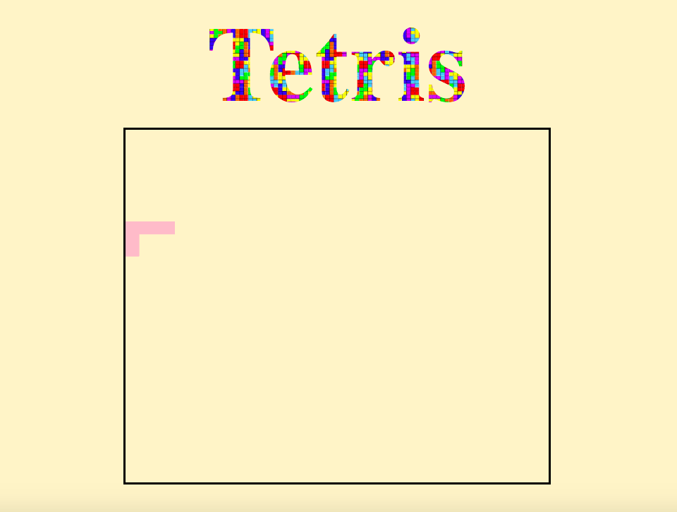

# TETRIS GAME :video_game:

## Phase 1
- [x] Add styling and html
- [x] Add a cubicle (just one) - just use a simple div for now
- [x] Move cubicle with keypress
- [x] Create a block for the tetris puzzles to move inside (it should not go outside it)
- [x] if it is down it should stay there (on the bottom)

After this phase it looks like : 

## Phase 2
- [x] Investigate creating unusual shapes and moving them to the file so they can stick together neatly - use HTML Canvas?
- [x] Move the block left and right
- [x] Move them around (key up)
- [x] Create interval so it goes down
- [x] Implement HTML tetris shape Canvas (instead clipping it from phase 1)
After this phase it looks like : 

## Phase 3
- [ ] Generate different shapes with different colors and push to array 4 shapes
- [ ] Add a block on the right side where you can see all possible shapes
- [ ] Randomly select different shapes

## Phase 4
- [ ] They should fit together neatly
- [ ] If there is one line fully taken, add a point, move the line down
